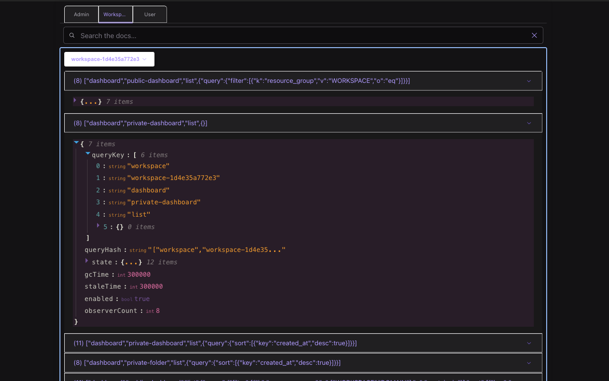

# Console Vue Query Devtools

A Chrome DevTools extension and SDK for debugging TanStack Query v5 in Vue 2.7, made for [Cloudforet Console](https://github.com/cloudforet-io/console).

## Background

The official [TanStack Query Devtools](https://tanstack.com/query/v5/docs/framework/vue/devtools) currently only supports **Vue 3.x**, which means **Vue 2.7** users cannot inspect or debug their query states with the native tooling.

However, [**Cloudforet Console**](https://github.com/cloudforet-io/console) — the frontend for the open-source Cloud Management Platform **Cloudforet** — is built with **Vue 2.7** and **TanStack Query v5**. This devtools project was born to fill the tooling gap in that context.

Unlike generic devtools, this extension is **tightly aligned with Cloudforet’s queryKey architecture**, which namespaces queries by scope (`admin`, `user`, `workspace`). The panel UI reflects this policy directly, providing scoped tabs and filtered inspection.

> 🛠️ **Note for Cloudforet contributors**:  
> This devtools was created specifically to support `cloudforet-io/console`. If you're contributing to that repository, this tool provides a consistent view into how queries are registered, cached, and grouped internally.

## Architecture

This is a **monorepo**, containing two main workspaces:

- **extension/** – The Chrome DevTools panel UI.
- **sdk/** – The queryClient registration logic injected into the product.

## Installation

### 🔹 Devtools Extension (Chrome)

Install the extension directly from the Chrome Web Store:  
👉 [Console Vue Query Devtools – Chrome Web Store](https://chromewebstore.google.com/detail/console-vue-query-devtool/akehibhefmaginaifkoffdpnbekgeoje)

Once installed, open your browser DevTools → click the **Console Vue Query Devtools** tab.

### 🔹 SDK (npm)

Install the SDK in your project (Vue 2.7 + TanStack Query v5 environment):

```bash
npm install console-vue-query-devtools-sdk
```

Then register it in your app:
```ts
// App.vue (script setup)
import { ConsoleVueQueryDevtools } from 'console-vue-query-devtools-sdk';

<template>
  <ConsoleVueQueryDevtools />
</template>
```

You don’t need to manually pass a `queryClient`—the SDK automatically retrieves it via `useQueryClient()` internally.

If you’re using a custom client, you can optionally pass it as a prop.

Here’s how it looks inside the DevTools panel:


## Features

- View all active queries (by tabbed context: admin / user / workspace)
- QueryKey-aware filtering and grouping
- Detail view with raw query data (using react-json-view)
- Compact, theme-aligned panel powered by Radix UI + Vanilla Extract

## Tech Stack

- Vue 2.7 + Vite (for SDK)
- React + Vite (for Extension panel)
- TanStack Query v5
- Radix UI + Vanilla Extract for styling
- Monorepo (pnpm workspaces)

## Status

This project is actively maintained and used daily in the [cloudforet-io/console](https://github.com/cloudforet-io/console) repository.

While it was originally developed for internal use, the devtools may benefit any Vue 2.7 project using TanStack Query v5.  
Contributions, feedback, and suggestions are very welcome!
